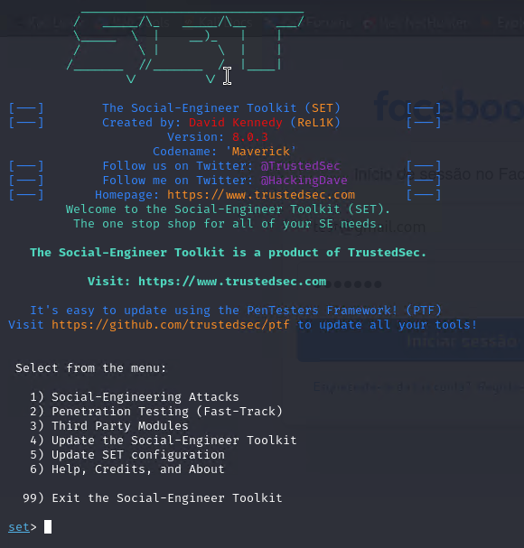
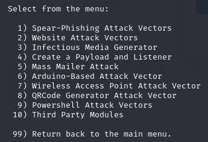
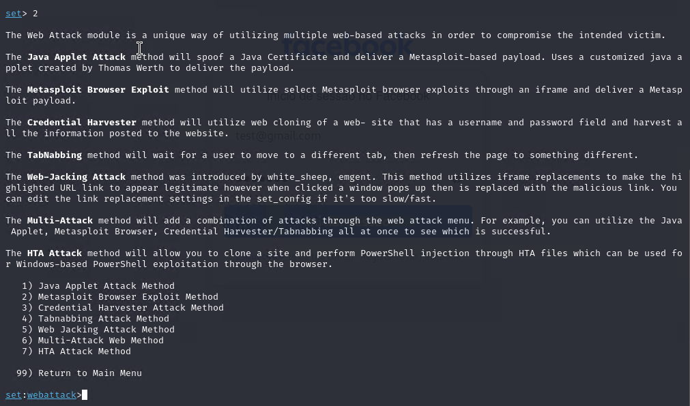
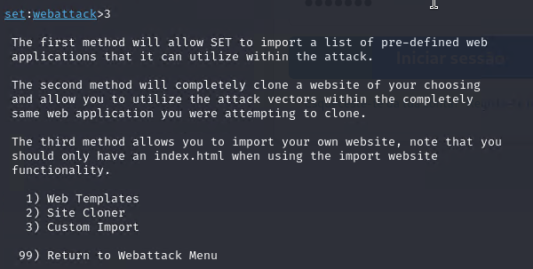
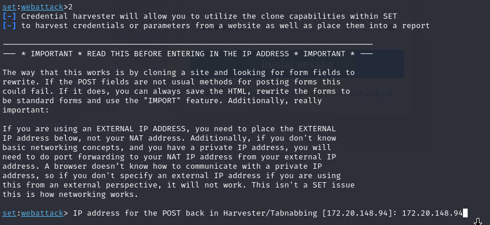
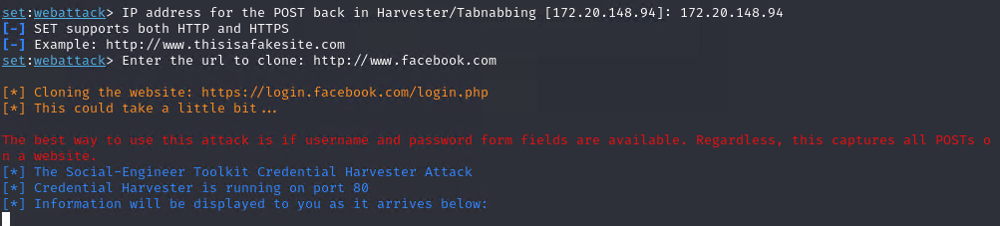
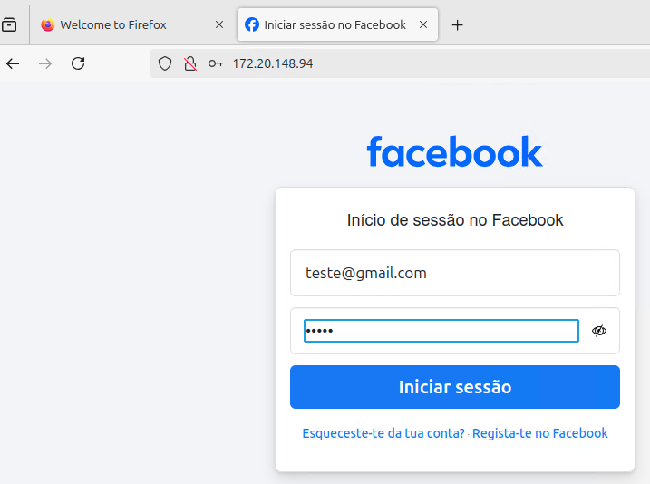

# Phishing para captura de senhas do Facebook

> **Nota:** Este repositório foi criado para fins **educativos** relacionados à **Cybersecurity** e segue o conteúdo apresentado no curso da **DIO (Digital Innovation One)**.  
> Todo o conteúdo aqui tem o propósito de aprendizado e conscientização sobre segurança da informação.  
> **Não utilize este material para atividades ilícitas ou que violem políticas e leis locais.** O autor não se responsabiliza por qualquer uso inadequado deste conteúdo.


### Ferramentas

- Kali Linux
- setoolkit

### Configurando o Phishing no Kali Linux

- Acesso root: ``` sudo su ```
- Iniciando o setoolkit: ``` setoolkit ```
  
   
  
- Tipo de ataque:1 -  ``` Social-Engineering Attacks ```
  


- Vetor de ataque: 2 - ``` Web Site Attack Vectors ```
  


- Método de ataque:3 -  ```Credential Harvester Attack Method ```
  


- Método de ataque: 2 - ``` Site Cloner ```



- Obtendo o endereço da máquina: ``` ifconfig para usar o IP da máquina```
  


- URL para clone: http://www.facebook.com
    
- Acesse a o IP



### Resutados


